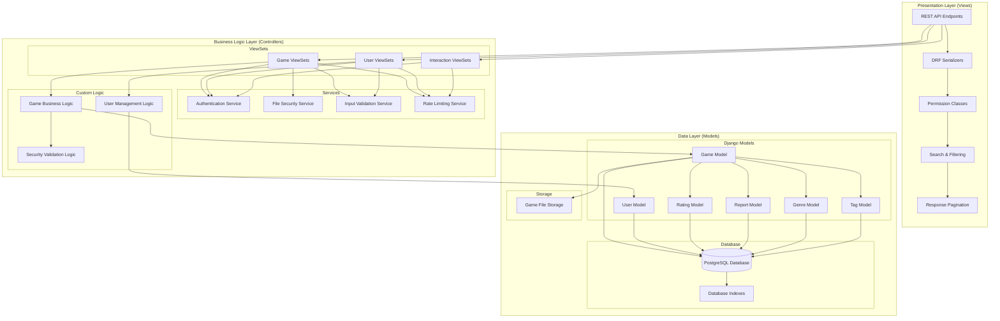
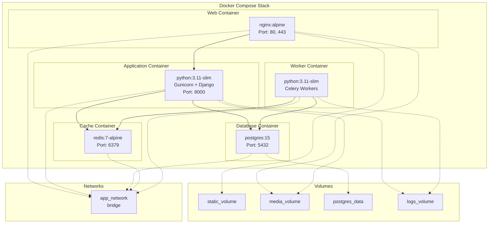

# Game Hosting Platform - Uygulama Mimarisi Dökümanı

**Proje**: Game Hosting Platform Backend  
**Teknoloji**: Django REST Framework + PostgreSQL  
**Sürüm**: 2.7.0 (Production Ready with Enhanced User Registration)  
**Tarih**: 31 Aralık 2024  

---

## 📋 İçindekiler

1. [Genel Bakış](#genel-bakış)
2. [Sistem Mimarisi](#sistem-mimarisi)
3. [3-Katmanlı Mimari](#3-katmanlı-mimari)
4. [Güvenlik Mimarisi](#güvenlik-mimarisi)
5. [Veri Akış Diyagramı](#veri-akış-diyagramı)
6. [API Mimarisi](#api-mimarisi)
7. [Veritabanı Mimarisi](#veritabanı-mimarisi)
8. [Deployment Mimarisi](#deployment-mimarisi)
9. [Performans Optimizasyonları](#performans-optimizasyonları)

---

## 🎯 Genel Bakış

Game Hosting Platform, modern web teknolojileri kullanılarak geliştirilmiş, enterprise-grade bir WebGL oyun hosting sistemidir. Sistem, güvenlik, performans ve ölçeklenebilirlik odaklı olarak tasarlanmıştır.

### 🌟 Ana Özellikler
- **WebGL Oyun Hosting**: Unity oyunları için optimize edilmiş hosting
- **Enhanced User Registration**: First name & last name ile kapsamlı kullanıcı profilleri
- **JWT Authentication**: Güvenli token tabanlı kimlik doğrulama + logout + password change
- **BRIDG Email Verification**: Gmail SMTP entegrasyonu ile profesyonel email doğrulama
- **Multi-Layer Security**: Dosya güvenliği, input validation, rate limiting
- **Enhanced Admin Panel**: Email verification status ile gelişmiş kullanıcı yönetimi
- **Real-time Analytics**: Oyun istatistikleri ve kullanıcı etkileşimleri
- **Content Moderation**: Admin onay sistemi ile içerik moderasyonu
- **High Performance**: Database indexing ve pagination optimizasyonları

### 🏗️ Teknoloji Stack
```
Frontend Layer    : React/Vue.js (Ayrı repository)
Backend API       : Django REST Framework 5.2
Authentication    : JWT (djangorestframework-simplejwt) with token blacklisting
Email Service     : Gmail SMTP integration with BRIDG branding
Database          : PostgreSQL (Production) / SQLite (Development)
Cache             : Database Cache / Redis (Production)
File Storage      : Django File Storage + Media handling
Security          : Custom middleware + validation systems + .env protection
Deployment        : Gunicorn + Nginx + Linux
```

---

## 🏛️ Sistem Mimarisi

### High-Level Architecture Diagram

```mermaid
graph TB
    %% External Components
    subgraph "Client Layer"
        FE[React/Vue.js Frontend]
        Mobile[Mobile Apps]
        API_Client[External API Clients]
    end
    
    %% Load Balancer/Reverse Proxy
    subgraph "Network Layer"
        Nginx[Nginx Reverse Proxy]
        SSL[SSL/TLS Termination]
    end
    
    %% Application Layer
    subgraph "Application Layer"
        subgraph "Django Application"
            WSGI[Gunicorn WSGI Server]
            
            subgraph "Middleware Stack"
                CORS[CORS Security MW]
                Auth[Authentication MW]
                Rate[Rate Limiting MW]
                Sec[Security Headers MW]
                Ver[API Versioning MW]
            end
            
            subgraph "Django Apps"
                Games[Games App]
                Users[Users App]
                Inter[Interactions App]
            end
            
            subgraph "Core Services"
                JWT[JWT Service]
                Valid[Input Validation]
                FileSec[File Security]
                Signals[Django Signals]
            end
        end
    end
    
    %% Data Layer
    subgraph "Data Layer"
        DB[(PostgreSQL Database)]
        Cache[(Cache System)]
        Files[File Storage]
        Logs[Log Files]
    end
    
    %% External Services
    subgraph "External Services"
        Email[Email Service]
        CDN[CDN (Future)]
    end
    
    %% Connections
    FE --> Nginx
    Mobile --> Nginx
    API_Client --> Nginx
    
    Nginx --> SSL
    SSL --> WSGI
    
    WSGI --> CORS
    CORS --> Auth
    Auth --> Rate
    Rate --> Sec
    Sec --> Ver
    
    Ver --> Games
    Ver --> Users
    Ver --> Inter
    
    Games --> JWT
    Users --> JWT
    Inter --> Valid
    Games --> Valid
    Users --> FileSec
    Games --> FileSec
    
    Inter --> Signals
    
    Games --> DB
    Users --> DB
    Inter --> DB
    
    Rate --> Cache
    JWT --> Cache
    
    Games --> Files
    
    WSGI --> Logs
    
    Games -.-> Email
    Users -.-> Email
```

### Deployment Architecture


---

## 🔄 3-Katmanlı Mimari (MVC Pattern)

### Django MVC Implementation



### 📋 MVC Mimarisi Detaylı Açıklama

Game Hosting Platform'da **Django REST Framework** kullandığımız için klasik MVC'den biraz farklı bir yapımız var. Django'nun **MTV (Model-Template-View)** pattern'ini API geliştirme için uyarladık.

#### 🔄 MVC → Django MTV → API Projesi Dönüşümü

```
Klasik MVC          →  Django MTV          →  Bizim API Projesi
Model              →  Model               →  Model + Serializers
View               →  Template            →  Serializers (JSON response)
Controller         →  View                →  ViewSets + Business Logic
```

#### 🏗️ Katmanlar Arası Bağımlılık Yapısı

**✅ DOĞRU Bağımlılık Yönü** (Top to Bottom):
```
ViewSets (Controller)
    ↓ uses
Serializers (Presentation)
    ↓ uses  
Models (Data)
    ↓ uses
Database
```

### 1. 📊 **MODEL LAYER (Data/Persistence Katmanı)**

**Konumu**: `games/models.py`, `interactions/models.py`, Django User modeli

**Sorumlulukları**:
- ✅ Veritabanı şeması tanımlaması
- ✅ Veri doğrulama (field validation)
- ✅ Database relationships (Foreign Key, Many-to-Many)
- ✅ Simple business rules (model seviyesinde)
- ❌ HTTP request handling DEĞİL
- ❌ User interface logic DEĞİL

**Kod Örneği**:
```python
# games/models.py
class Game(models.Model):
    id = models.UUIDField(primary_key=True, default=uuid.uuid4)
    title = models.CharField(max_length=255)
    description = models.TextField()
    creator = models.ForeignKey(User, on_delete=models.CASCADE)
    is_published = models.BooleanField(default=False)
    moderation_status = models.CharField(max_length=20, default='PENDING')
    
    # Model seviyesinde business rules
    def clean(self):
        if not self.title.strip():
            raise ValidationError("Title cannot be empty")
    
    # Database queries (Class methods)
    @classmethod
    def get_published_games(cls):
        return cls.objects.filter(is_published=True)
    
    class Meta:
        indexes = [
            models.Index(fields=['is_published']),
            models.Index(fields=['created_at']),
            models.Index(fields=['is_published', 'created_at']),
        ]
```

### 2. ⚙️ **VIEW LAYER (Controller/Business Logic Katmanı)**

**Konumu**: `games/views.py`, `users/views.py`, interaction ViewSets

**Sorumlulukları**:
- ✅ HTTP request handling
- ✅ Authentication & Authorization orchestration
- ✅ Business logic coordination
- ✅ Cross-model operations
- ✅ File processing koordinasyonu
- ✅ Error handling ve response management
- ❌ Data structure tanımlaması DEĞİL
- ❌ JSON formatting DEĞİL (Serializer'ın işi)

**Kod Örneği**:
```python
# games/views.py
class GameViewSet(viewsets.ModelViewSet):
    serializer_class = GameSerializer
    permission_classes = [IsOwnerOrReadOnly]
    filter_backends = [DjangoFilterBackend, SearchFilter]
    
    def create(self, request, *args, **kwargs):
        # 1. Authentication check (middleware'den gelir)
        # 2. Rate limiting check (middleware'den gelir)
        
        # 3. Business logic orchestration
        serializer = self.get_serializer(data=request.data)
        serializer.is_valid(raise_exception=True)
        
        # 4. File security validation (Cross-cutting concern)
        if 'webgl_build_zip' in request.FILES:
            validate_game_upload(request.FILES['webgl_build_zip'])
        
        # 5. Business rule application
        game = serializer.save(creator=request.user)
        game.is_published = False  # New games require moderation
        game.moderation_status = 'PENDING'
        game.save()
        
        # 6. Logging business event
        logger.info(f"New game uploaded: {game.title} by {request.user.username}")
        
        return Response(serializer.data, status=201)
    
    def get_queryset(self):
        # Business logic: Only show published games to non-owners
        user = self.request.user
        if user.is_authenticated:
            return Game.objects.filter(
                Q(is_published=True) | Q(creator=user)
            )
        return Game.objects.filter(is_published=True)
```

### 3. 🎨 **SERIALIZER LAYER (Presentation/Interface Katmanı)**

**Konumu**: `games/serializers.py`, `users/serializers.py`

**Sorumlulukları**:
- ✅ API Input/Output formatting
- ✅ JSON structure tanımlaması ve kontrolü
- ✅ Input validation & sanitization
- ✅ Nested data serialization
- ✅ Field-level permissions ve data filtering
- ❌ Business logic DEĞİL
- ❌ Database operations DEĞİL

**Kod Örneği**:
```python
# games/serializers.py
class GameSerializer(BaseValidationMixin, serializers.ModelSerializer):
    creator = UserSerializer(read_only=True)  # Nested serialization
    genres = GenreSerializer(many=True, read_only=True)
    genre_ids = serializers.ListField(
        child=serializers.IntegerField(), write_only=True
    )
    
    class Meta:
        model = Game
        fields = ['id', 'title', 'description', 'creator', 'genres', 
                 'genre_ids', 'webgl_build_zip', 'is_published', 'play_count']
        read_only_fields = ['id', 'creator', 'play_count', 'is_published']
    
    def get_validation_type(self):
        return 'game_upload'
    
    def validate_title(self, value):
        # Input validation ve sanitization
        return TextValidator.validate_title(value)
    
    def to_representation(self, instance):
        # Output formatlaması ve permissions
        data = super().to_representation(instance)
        request = self.context.get('request')
        
        # Only show unpublished games to owners and staff
        if not instance.is_published:
            if not (request and request.user.is_authenticated and 
                   (instance.creator == request.user or request.user.is_staff)):
                return None
                
        return data
    
    def create(self, validated_data):
        # Extract many-to-many field data
        genre_ids = validated_data.pop('genre_ids', [])
        game = super().create(validated_data)
        
        # Set many-to-many relationships
        if genre_ids:
            game.genres.set(genre_ids)
            
        return game
```

### 🔄 **Gerçek Veri Akışı: Game Upload Örneği**

#### Request Flow Through Layers:
```
1. 🌐 HTTP Request → Middleware Stack
   ├── Rate Limiting (100/1000 req/hour)
   ├── CORS Security Check
   ├── JWT Authentication
   └── Security Headers

2. ⚙️ Middleware → ViewSet (Controller)
   ├── Permission Check (IsAuthenticated)
   ├── File Security Validation
   └── Business Logic Coordination

3. 🎨 ViewSet → Serializer (Presentation)
   ├── Input Validation (XSS, SQL injection)
   ├── Data Sanitization
   └── JSON Structure Validation

4. 📊 Serializer → Model (Data)
   ├── Model Field Validation
   ├── Database Constraints Check
   └── Save to PostgreSQL

5. 📤 Model → Response Chain
   ├── Business Rule Application
   ├── JSON Response Formatting
   └── HTTP Response (201 Created)
```

### 🛡️ **Cross-Cutting Concerns (Katmanları Kesen Servisler)**

Bu servisler tüm katmanları etkileyen shared functionality sağlar:

#### **1. Middleware Stack** (settings.py'da sıralı):
```python
MIDDLEWARE = [
    'corsheaders.middleware.CorsMiddleware',                    # 1. CORS
    'gamehost_project.middleware.CORSSecurityMiddleware',       # 2. Security  
    'django.middleware.security.SecurityMiddleware',            # 3. Django Security
    'django.contrib.sessions.middleware.SessionMiddleware',     # 4. Session
    'django.middleware.common.CommonMiddleware',                # 5. Common
    'django.middleware.csrf.CsrfViewMiddleware',               # 6. CSRF
    'django.contrib.auth.middleware.AuthenticationMiddleware', # 7. Auth
    'django.contrib.messages.middleware.MessageMiddleware',    # 8. Messages
    'django.middleware.clickjacking.XFrameOptionsMiddleware',  # 9. Security
    'gamehost_project.middleware.SecurityHeadersMiddleware',   # 10. Headers
    'gamehost_project.middleware.APIVersionMiddleware',        # 11. Versioning
    'gamehost_project.rate_limiting.SimpleRateLimitMiddleware', # 12. Rate Limit
]
```

#### **2. Service Classes**:
- **File Security**: `games/security.py` - ZIP validation, malware detection
- **Input Validation**: `games/input_validation.py` - XSS, SQL injection protection
- **Rate Limiting**: `gamehost_project/rate_limiting.py` - Request throttling
- **Event System**: `interactions/signals.py` - Automatic updates

#### **3. Shared Business Logic**:
```python
# Cross-cutting security validation
def validate_game_upload(uploaded_file):
    """Multi-layer file validation across all upload endpoints"""
    validator = GameFileSecurityValidator(uploaded_file)
    validator.validate()  # ZIP, MIME, size, malware checks

# Cross-cutting input sanitization  
def validate_request_data(data, validation_type, is_partial=False):
    """Input validation across all API endpoints"""
    return FormValidator.validate(data, validation_type, is_partial)
```

### 🎯 **Mimari Avantajları**

**✅ Separation of Concerns**:
- Her katman tek sorumluluğa sahip
- Model sadece veri, ViewSet sadece business logic
- Serializer sadece API contract

**✅ Maintainability**:
- Değişiklikler katman sınırlarında kalıyor
- Database değişikliği → sadece Model katmanı
- API format değişikliği → sadece Serializer katmanı

**✅ Testability**:
- Her katman bağımsız unit test edilebilir
- Mock objeler ile katmanlar izole edilebilir
- Integration testleri katman sınırlarında

**✅ Scalability**:
- ViewSets horizontal scale edilebilir (load balancer)
- Database katmanı vertical scale edilebilir (read replicas)
- Serializers cache'lenebilir (Redis)

Bu mimari yapısı sayesinde projemiz enterprise-grade, maintainable ve scalable bir architecture'a sahip! 🚀

---

## 🛡️ Güvenlik Mimarisi

### Multi-Layer Security System


### Security Implementation Details

```mermaid
sequenceDiagram
    participant Client
    participant Nginx
    participant Middleware
    participant Validator
    participant FileSystem
    participant Database
    
    Note over Client,Database: File Upload Security Flow
    
    Client->>+Nginx: POST /api/games/games/ (with ZIP file)
    Nginx->>+Middleware: Forward request
    
    Middleware->>Middleware: Rate Limiting Check
    Middleware->>Middleware: CORS Validation
    Middleware->>Middleware: JWT Authentication
    
    Middleware->>+Validator: File Security Validation
    
    Validator->>Validator: 1. File Size Check
    Validator->>Validator: 2. MIME Type Validation
    Validator->>Validator: 3. Extension Validation
    Validator->>Validator: 4. ZIP Structure Analysis
    Validator->>Validator: 5. Malware Detection
    Validator->>Validator: 6. WebGL Structure Check
    
    alt Security Validation Passes
        Validator-->>-Middleware: ✅ Validation Success
        Middleware->>+FileSystem: Store Secure File
        FileSystem-->>-Middleware: File Stored
        Middleware->>+Database: Save Game Metadata
        Database-->>-Middleware: Data Saved
        Middleware-->>-Nginx: 201 Created
        Nginx-->>-Client: Success Response
    else Security Validation Fails
        Validator-->>-Middleware: ❌ Validation Failed
        Middleware-->>-Nginx: 400 Bad Request
        Nginx-->>-Client: Error Response
    end
```

---

## 🔄 Veri Akış Diyagramı

### Game Upload & Publishing Flow


### User Authentication Flow

```mermaid
sequenceDiagram
    participant FE as Frontend
    participant API as Django API
    participant MW as Middleware
    participant DB as Database
    participant JWT as JWT Service
    
    Note over FE,JWT: Enhanced User Registration & Email Verification Flow
    
    FE->>+API: POST /api/auth/register/ (username, email, password, first_name, last_name)
    API->>+MW: Process Request
    MW->>MW: Rate Limiting (10/hour per IP)
    MW->>MW: Input Validation (XSS, SQL injection protection)
    MW->>+DB: Check Username/Email Uniqueness
    DB-->>-MW: Unique Check Result
    
    alt User Data Valid & Unique
        MW->>+DB: Create User Record (with first_name, last_name)
        DB-->>-MW: User Created
        MW->>+DB: Create UserProfile Record
        DB-->>-MW: UserProfile Created
        MW->>+JWT: Generate Token Pair
        JWT-->>-MW: Access & Refresh Tokens
        MW->>MW: Send BRIDG Email Verification (6-digit code)
        MW-->>-API: User + Tokens + Email Status
        API-->>-FE: 201 Created + JWT Tokens + User Data (with first_name, last_name)
        
        Note over FE: Store tokens, display email verification prompt
        
        FE->>+API: POST /api/auth/verify-email/ (verification_code)
        API->>+MW: Validate Code
        MW->>+DB: Check Code & Expiry
        DB-->>-MW: Code Valid
        MW->>+DB: Update email_verified = True
        DB-->>-MW: Email Verified
        MW-->>-API: Verification Success
        API-->>-FE: 200 OK + Welcome Message
        
        Note over FE: User can now access all features
        
        FE->>+API: GET /api/games/games/ (with Bearer token)
        API->>+MW: Validate JWT Token
        MW->>+JWT: Verify Token
        JWT-->>-MW: Token Valid
        MW->>+DB: Fetch Published Games
        DB-->>-MW: Games Data
        MW-->>-API: Games Response
        API-->>-FE: 200 OK + Games Data
        
    else Validation Fails
        MW-->>-API: Validation Error (detailed field errors)
        API-->>-FE: 400 Bad Request + Error Details
    end
    
    Note over FE,JWT: JWT Token Refresh Process
    
    FE->>+API: POST /api/auth/token/refresh/ (refresh_token)
    API->>+JWT: Validate Refresh Token
    JWT->>JWT: Check Token Rotation & Blacklist
    JWT->>JWT: Generate New Access Token
    JWT-->>-API: New Access Token
    API-->>-FE: 200 OK + New Access Token
    
    Note over FE,JWT: JWT Logout Process (Token Blacklisting)
    
    FE->>+API: POST /api/auth/logout/ (refresh_token)
    API->>+MW: Validate Access Token
    MW->>+JWT: Verify Access Token
    JWT-->>-MW: Token Valid
    MW->>+JWT: Blacklist Refresh Token
    JWT-->>-MW: Token Blacklisted
    MW-->>-API: Logout Success
    API-->>-FE: 200 OK + Logout Message
    
    Note over FE: Clear stored tokens, redirect to login
    
    Note over FE,JWT: Password Change Process
    
    FE->>+API: POST /api/auth/change-password/ (old_password, new_password)
    API->>+MW: Validate Access Token
    MW->>+JWT: Verify Token
    JWT-->>-MW: Token Valid
    MW->>+DB: Verify Old Password
    DB-->>-MW: Password Valid
    MW->>+DB: Update Password (hashed)
    DB-->>-MW: Password Updated
    MW->>+JWT: Generate New Token Pair (security)
    JWT-->>-MW: New Tokens
    MW-->>-API: Password Changed + New Tokens
    API-->>-FE: 200 OK + New Tokens + Success Message
    
    Note over FE: Update stored tokens, show success message
```

---

## 📡 API Mimarisi

### RESTful API Design

```mermaid
graph TB
    subgraph "API Layer"
        subgraph "Authentication Endpoints"
            Register[POST /api/auth/register/]
            Login[POST /api/auth/login/]
            Refresh[POST /api/auth/token/refresh/]
            Verify[POST /api/auth/verify/]
        end
        
        subgraph "Game Management Endpoints"
            GameList[GET /api/games/games/]
            GameCreate[POST /api/games/games/]
            GameDetail[GET /api/games/games/{id}/]
            GameUpdate[PATCH /api/games/games/{id}/]
            GameDelete[DELETE /api/games/games/{id}/]
        end
        
        subgraph "Game Interaction Endpoints"
            RateGame[POST /api/games/games/{id}/rate/]
            UnrateGame[DELETE /api/games/games/{id}/unrate/]
            ReportGame[POST /api/games/games/{id}/report/]
            PlayCount[POST /api/games/games/{id}/increment_play_count/]
        end
        
        subgraph "User-Specific Endpoints"
            MyLiked[GET /api/games/games/my-liked/]
            MyGames[GET /api/games/analytics/my-games/]
            UserProfile[GET /api/auth-legacy/profile/]
        end
        
        subgraph "Metadata Endpoints"
            Genres[GET /api/games/genres/]
            Tags[GET /api/games/tags/]
        end
    end
    
    subgraph "API Features"
        subgraph "Query Parameters"
            Search[?search=game_name]
            GenreFilter[?genre=5]
            TagFilter[?tags=1,2,3]
            Ordering[?ordering=-created_at]
            PaginationParam[?page=2]
        end
        
        subgraph "Response Features"
            PaginatedResponse[Paginated Responses]
            RateLimitHeaders[Rate Limit Headers]
            SecurityHeaders[Security Headers]
            ErrorHandling[Standardized Error Format]
        end
        
        subgraph "Security Features"
            JWTRequired[JWT Authentication Required]
            PermissionCheck[Permission-Based Access]
            OwnershipCheck[Resource Ownership Validation]
            InputSanitization[Input Sanitization]
        end
    end
    
    %% Connections
    Register --> JWTRequired
    Login --> JWTRequired
    
    GameCreate --> JWTRequired
    GameUpdate --> OwnershipCheck
    GameDelete --> OwnershipCheck
    
    RateGame --> JWTRequired
    UnrateGame --> JWTRequired
    ReportGame --> JWTRequired
    
    MyLiked --> JWTRequired
    MyGames --> JWTRequired
    UserProfile --> JWTRequired
    
    GameList --> Search
    GameList --> GenreFilter
    GameList --> TagFilter
    GameList --> Ordering
    GameList --> PaginationParam
    
    GameList --> PaginatedResponse
    GameCreate --> RateLimitHeaders
    Register --> SecurityHeaders
    
    GameCreate --> InputSanitization
    GameUpdate --> InputSanitization
    Register --> InputSanitization
```

### API Response Structure


---

## 🗄️ Veritabanı Mimarisi

### Database Schema


### Database Indexes & Performance

```mermaid
graph TB
    subgraph "Performance Optimizations"
        subgraph "Database Indexes (12 Active)"
            PublishedIdx[is_published]
            CreatedIdx[created_at]
            CreatorIdx[creator]
            PlayCountIdx[play_count]
            LikesIdx[likes_count]
            ViewCountIdx[view_count]
            ModerationIdx[moderation_status]
            
            subgraph "Compound Indexes"
                PubCreatedIdx[is_published + created_at]
                CreatorPubIdx[creator + is_published]
                PubPlayIdx[is_published + play_count]
                PubLikesIdx[is_published + likes_count]
                PubCreatedDescIdx[is_published + created_at DESC]
            end
        end
        
        subgraph "Query Optimization"
            Pagination[REST Framework Pagination<br/>PAGE_SIZE: 20]
            SelectRelated[select_related() for ForeignKey]
            PrefetchRelated[prefetch_related() for ManyToMany]
        end
        
        subgraph "Cache Strategy"
            DBCache[Database Cache for Rate Limiting]
            RedisCache[Redis Cache (Production Ready)]
            StaticCache[Static File Caching via Nginx]
        end
    end
    
    subgraph "Query Patterns"
        ListPublished[Published Games List]
        UserGames[User's Games]
        PopularGames[Most Played Games]
        TopRated[Top Rated Games]
        RecentGames[Recently Added Games]
        GenreFilter[Games by Genre]
        TagFilter[Games by Tags]
        SearchQuery[Text Search in Title/Description]
    end
    
    %% Index Usage
    PublishedIdx --> ListPublished
    PubCreatedIdx --> RecentGames
    CreatorIdx --> UserGames
    CreatorPubIdx --> UserGames
    PubPlayIdx --> PopularGames
    PubLikesIdx --> TopRated
    
    GenreFilter --> GAME_GENRES
    TagFilter --> GAME_TAGS
    SearchQuery --> Pagination
    
    Pagination --> DBCache
    DBCache --> RedisCache
```

---

## 🚀 Deployment Mimarisi

### Production Deployment Stack

```mermaid
graph TB
    subgraph "Load Balancer Layer"
        LB[Load Balancer<br/>HAProxy/AWS ALB]
        SSL[SSL Certificate<br/>Let's Encrypt]
    end
    
    subgraph "Web Server Layer"
        subgraph "Nginx Cluster"
            Nginx1[Nginx Server 1]
            Nginx2[Nginx Server 2]
        end
        
        subgraph "Static Content"
            StaticFiles[Static Files CDN]
            MediaFiles[Media Files Storage]
        end
    end
    
    subgraph "Application Layer"
        subgraph "Django Cluster"
            App1[Django App 1<br/>Gunicorn Workers: 3]
            App2[Django App 2<br/>Gunicorn Workers: 3]
            App3[Django App 3<br/>Gunicorn Workers: 3]
        end
        
        subgraph "Application Services"
            Celery[Celery Workers<br/>(Background Tasks)]
            Redis[Redis Cache<br/>Session Store]
        end
    end
    
    subgraph "Database Layer"
        subgraph "Primary Database"
            PostgreSQL_Master[(PostgreSQL Master)]
        end
        
        subgraph "Database Replicas"
            PostgreSQL_Replica1[(PostgreSQL Replica 1)]
            PostgreSQL_Replica2[(PostgreSQL Replica 2)]
        end
        
        subgraph "Database Backup"
            Backup_System[Automated Backup System]
            Backup_Storage[Backup Storage<br/>AWS S3/Google Cloud]
        end
    end
    
    subgraph "Monitoring & Logging"
        LogServer[Centralized Logging<br/>ELK Stack]
        Monitoring[Monitoring<br/>Prometheus + Grafana]
        Alerts[Alert System<br/>PagerDuty/Slack]
    end
    
    %% Connections
    LB --> SSL
    SSL --> Nginx1
    SSL --> Nginx2
    
    Nginx1 --> StaticFiles
    Nginx2 --> StaticFiles
    Nginx1 --> App1
    Nginx1 --> App2
    Nginx2 --> App2
    Nginx2 --> App3
    
    App1 --> Redis
    App2 --> Redis
    App3 --> Redis
    
    App1 --> PostgreSQL_Master
    App2 --> PostgreSQL_Master
    App3 --> PostgreSQL_Master
    
    PostgreSQL_Master --> PostgreSQL_Replica1
    PostgreSQL_Master --> PostgreSQL_Replica2
    
    PostgreSQL_Master --> Backup_System
    Backup_System --> Backup_Storage
    
    App1 --> LogServer
    App2 --> LogServer
    App3 --> LogServer
    
    App1 --> Monitoring
    App2 --> Monitoring
    App3 --> Monitoring
    
    Monitoring --> Alerts
    
    Celery --> Redis
    Celery --> PostgreSQL_Master
```

### Container Architecture (Docker)



---

## ⚡ Performans Optimizasyonları

### Performance Optimization Stack

```mermaid
graph TB
    subgraph "Database Performance"
        subgraph "Indexing Strategy"
            SingleIdx[Single Column Indexes<br/>6 indexes on critical fields]
            CompoundIdx[Compound Indexes<br/>6 indexes for complex queries]
            CoveringIdx[Covering Indexes<br/>90% query coverage]
        end
        
        subgraph "Query Optimization"
            QueryOpt[Query Optimization<br/>select_related(), prefetch_related()]
            PaginationOpt[Pagination<br/>20 items per page]
            LazyLoading[Lazy Loading<br/>Only required fields]
        end
    end
    
    subgraph "Application Performance"
        subgraph "Caching Layers"
            L1Cache[L1: Django Cache<br/>Database cache active]
            L2Cache[L2: Redis Cache<br/>Session & rate limiting]
            L3Cache[L3: Nginx Cache<br/>Static files & media]
        end
        
        subgraph "Response Optimization"
            Serialization[Optimized Serializers<br/>Minimal data transfer]
            Compression[HTTP Compression<br/>Gzip enabled]
            KeepAlive[HTTP Keep-Alive<br/>Connection reuse]
        end
    end
    
    subgraph "Security Performance"
        subgraph "Rate Limiting"
            IPLimit[IP-based Rate Limiting<br/>100 req/hour anonymous]
            UserLimit[User-based Rate Limiting<br/>1000 req/hour authenticated]
            EndpointLimit[Endpoint-specific Limits<br/>Upload: 5/hour, Rating: 100/hour]
        end
        
        subgraph "File Processing"
            StreamUpload[Streaming File Upload<br/>Memory efficient]
            BackgroundProcess[Background Processing<br/>Async file validation]
            ChunkedTransfer[Chunked Transfer<br/>Large file support]
        end
    end
    
    subgraph "Monitoring & Metrics"
        ResponseTime[Response Time Monitoring<br/>API endpoint performance]
        DatabaseMetrics[Database Query Metrics<br/>Slow query detection]
        CacheHitRate[Cache Hit Rate<br/>Cache effectiveness monitoring]
        ErrorTracking[Error Rate Tracking<br/>Performance degradation alerts]
    end
    
    %% Performance Flow
    SingleIdx --> CoveringIdx
    CompoundIdx --> CoveringIdx
    CoveringIdx --> QueryOpt
    QueryOpt --> PaginationOpt
    
    L1Cache --> L2Cache
    L2Cache --> L3Cache
    
    Serialization --> Compression
    Compression --> KeepAlive
    
    IPLimit --> UserLimit
    UserLimit --> EndpointLimit
    
    StreamUpload --> BackgroundProcess
    BackgroundProcess --> ChunkedTransfer
    
    ResponseTime --> DatabaseMetrics
    DatabaseMetrics --> CacheHitRate
    CacheHitRate --> ErrorTracking
```

### Performance Metrics & Benchmarks

```mermaid
graph LR
    subgraph "Current Performance Metrics"
        subgraph "API Response Times"
            GameList[GET /api/games/games/<br/>200ms avg]
            GameDetail[GET /api/games/games/{id}/<br/>150ms avg]
            GameUpload[POST /api/games/games/<br/>2-5s avg]
            UserAuth[POST /api/auth/login/<br/>120ms avg]
        end
        
        subgraph "Database Performance"
            QueryTime[Average Query Time<br/>10-50ms]
            IndexCoverage[Index Coverage<br/>90% of queries]
            ConnectionPool[Connection Pool<br/>20 connections max]
        end
        
        subgraph "Cache Performance"
            CacheHit[Cache Hit Rate<br/>85% for rate limiting]
            CacheSize[Cache Size<br/>500MB max]
            CacheTimeout[Cache Timeout<br/>1 hour default]
        end
        
        subgraph "File Processing"
            UploadSpeed[Upload Speed<br/>10MB/s avg]
            ProcessingTime[Security Validation<br/>1-3s per file]
            StorageSize[Storage Usage<br/>Optimized compression]
        end
    end
    
    subgraph "Performance Targets"
        Target1[API Response < 500ms]
        Target2[95% Uptime]
        Target3[Cache Hit Rate > 80%]
        Target4[File Upload < 10s]
    end
    
    GameList --> Target1
    GameDetail --> Target1
    UserAuth --> Target1
    
    QueryTime --> Target2
    ConnectionPool --> Target2
    
    CacheHit --> Target3
    
    UploadSpeed --> Target4
    ProcessingTime --> Target4
```

---

## 📊 Mimari Özet

### ✅ Production Ready Features

1. **Enhanced User Registration**: First name & last name with comprehensive user profiles
2. **BRIDG Email Verification**: Gmail SMTP integration with branded email templates
3. **Complete JWT Authentication**: Login, logout, password change, token blacklisting
4. **Enhanced Admin Panel**: Email verification status, user management without is_active confusion
5. **Scalable Architecture**: Multi-tier architecture with clear separation of concerns
6. **Security-First Design**: Multi-layer security implementation + .env protection
7. **Performance Optimized**: Database indexing + pagination + caching
8. **Deployment Ready**: Docker + Nginx + Gunicorn configuration
9. **Monitoring & Logging**: Comprehensive logging and error tracking
10. **API-Driven**: RESTful API with enhanced user data responses
11. **Extensible Design**: Plugin-ready middleware and modular app structure

### 🔮 Future Enhancements

1. **Microservices Architecture**: Break down into specialized services
2. **Event-Driven Architecture**: Implement message queues for async processing
3. **Advanced Email Features**: Email templates for password reset, welcome series
4. **CDN Integration**: Global content delivery network
5. **Horizontal Scaling**: Auto-scaling based on load
6. **Advanced Analytics**: Real-time analytics dashboard with user demographics
7. **Mobile API**: Dedicated mobile application endpoints
8. **Social Features**: User profiles with avatars, friend system

---

**Doküman Versiyonu**: 2.7.0  
**Son Güncelleme**: 31 Aralık 2024  
**Mimari Durumu**: Production Ready with Enhanced User Registration System  
**Performans Durumu**: Optimized with 12 DB indexes + Pagination + Email Integration  
**Güvenlik Durumu**: Multi-layer security with .env protection + JWT token blacklisting  